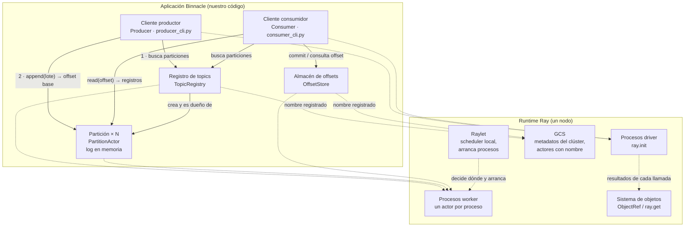

# Arquitectura del prototipo y mapa de dependencias del middleware

Fase 1. Describe el prototipo de `ray-prototype/`, que corre en **un solo nodo de Ray en Windows**: cada actor vive en su propio proceso worker, pero todos en la misma máquina.

Responde una pregunta: **¿qué tuvo que hacer Ray para que este código aparentemente simple funcionara entre procesos?** Cada fila del mapa se convierte después en una decisión del registro de decisiones (#30) y en trabajo de la Fase 2.

---

## 1. Diagrama de arquitectura

Las flechas **continuas** son llamadas entre componentes de la aplicación. Parecen llamadas a métodos locales, pero cada una es un mensaje entre procesos que Ray envía, encola y entrega. Las flechas **punteadas** muestran en qué pieza de Ray se apoya cada componente.

### Componentes

| Componente | Qué es | Dónde vive |
|---|---|---|
| Cliente productor | Elige la partición (SHA-256 de la key, o round-robin sin key) y escribe lotes | Proceso driver propio (`producer_cli.py`) |
| Cliente consumidor | Lee desde el offset confirmado, procesa y confirma después (at-least-once) | Proceso driver propio (`consumer_cli.py`) |
| Registro de topics | Mapa topic → particiones. Actor con nombre y *detached*: sobrevive al driver que lo creó | Proceso worker |
| Partición | Log ordenado append-only en memoria | Un proceso worker por partición |
| Almacén de offsets | Offsets confirmados por (grupo, topic, partición), en memoria. Actor con nombre y *detached* | Proceso worker |
| GCS | Servicio central de Ray: conoce los nodos y los actores con nombre | Nodo head |
| Raylet | Scheduler de cada nodo: decide en qué proceso corre cada actor y lo arranca | Un proceso por nodo |
| Procesos worker | Ejecutan los actores; no comparten memoria entre sí | Uno por actor |
| Sistema de objetos | Lleva el resultado de cada llamada remota al que la hizo (`ObjectRef` + `ray.get`) | Distribuido entre procesos |

---

## 2. Mapa de dependencias del middleware

Tabla con las filas y columnas exactas de la metodología. Debajo, notas con la evidencia de cada fila.

| Requisito | Mecanismo en Fase 1 | Pregunta para el rediseño nativo |
|---|---|---|
| **ejecución remota** | Llamadas a métodos de actor (`actor.metodo.remote()`). Ray tasks solo en una prueba de concurrencia. | ¿Qué protocolo explícito hace falta? Un servicio gRPC (`BrokerService`) con operaciones, timeouts y comportamiento ante conexión caída definidos. |
| **worker con estado** | Ray actors: `PartitionActor` (log), `TopicRegistry` (topics) y `OffsetStore` (offsets), todos con el estado **solo en memoria** de su proceso. | ¿Qué proceso posee el estado y cómo se recupera? El broker líder posee cada partición; el log va a un WAL en disco y se reconstruye al reiniciar; los offsets necesitan persistencia propia. |
| **scheduling** | Runtime Ray (raylet): decide en qué proceso corre cada actor. Nunca lo elegimos. Con un solo nodo, solo reparte entre procesos. | ¿Hace falta scheduling dinámico? Probablemente no: asignación estática de particiones a brokers por configuración, reasignada solo por elección de líder; y reparto de particiones a consumidores a cargo del coordinador del grupo. |
| **resultado remoto** | `ObjectRef` + `ray.get` bloqueante. El resultado de un produce es el offset base (el "ack"); el de un fetch, los registros. | ¿Basta job ID + result store? No hace falta un result store: la respuesta del RPC es el resultado. Lo que falta resolver es qué pasa si esa respuesta se pierde (F8). |
| **membresía** | Runtime Ray: el GCS conoce los nodos y los actores con nombre. Los clientes se unen con `ray.init(address="auto")` y encuentran el registro y los offsets por nombre. Los consumidores de un grupo no se conocen entre sí. | ¿Bootstrap estático, registro, gossip, DHT, coordinador? Lista estática de brokers semilla + RPC de metadatos; heartbeats entre brokers; coordinador de grupo para los consumidores. |
| **reintento** | Política por defecto de Ray: un actor muerto no se reinicia (`max_restarts=0`) y una llamada a actor fallida no se reintenta (`max_task_retries=0`). Nuestro código: el productor no reintenta; el consumidor confirma después de procesar. | ¿Cuál es la semántica real de reintento? Productor que reintenta con ID de productor + número de secuencia para no duplicar (G8); consumidor at-least-once (G9). |
| **recursos** | Recursos lógicos de Ray (CPU, memoria, object store). Los actores no declaran ninguno: **no retienen CPU mientras corren**. | ¿Qué restricciones importan realmente? No las CPU lógicas, sino disco (tamaño y retención del log), memoria de buffers y peticiones en vuelo (backpressure). |
| **observabilidad** | Dashboard y State API de Ray, **desactivados** en todo el prototipo (`include_dashboard=False`). La evidencia la produce nuestro código: `whereami()` (proceso y nodo), salida JSON de los CLI con el PID, y las validaciones de la demo. | ¿Qué evidencia debe exponer la versión nativa? Endpoint de métricas (lag, líder por partición, réplicas) y logs estructurados con IDs estables (broker, partición, epoch, productor, grupo). |

### Evidencia por fila

- **Ejecución remota:** `test_partitions_run_in_separate_processes` y `demo_partitions.py` muestran un PID distinto por partición, diferente del PID del driver. La única Ray task es `produce_batch` en `test_partition.py`.
- **Worker con estado:** `partition.py`, `registry.py` y `offsets.py`. Ningún actor declara `max_restarts`. Qué se pierde al morir uno queda **por verificar** en el #29.
- **Scheduling:** ningún actor declara recursos ni opciones de ubicación; `whereami()` solo deja ver la decisión de Ray después de tomada.
- **Resultado remoto:** todas las llamadas usan `ray.get(...)`. `Producer.send` devuelve el offset de `append` como confirmación.
- **Membresía:** `get_or_create_registry()` y `get_or_create_offset_store()` usan `name`, `namespace`, `lifetime="detached"` y `get_if_exists=True`.
- **Reintento:** `max_restarts` y `max_task_retries` son los valores por defecto documentados por Ray; no se cambian en ningún sitio. Comportamiento real ante un fallo: **por verificar** en el #29.
- **Recursos:** verificado el 2026-10-05. Con `ray.init(num_cpus=1)` conviven el registro y 8 particiones, cada una en su proceso, y la CPU disponible sigue en 1.0. El `num_cpus=max(4, particiones + 2)` de `demo_producer_consumer.py` no es necesario para los actores.
- **Observabilidad:** verificado el 2026-10-05. Con el dashboard desactivado, `ray.util.state.list_actors()` falla con `ServerUnavailable`.

---

## 3. Filas propias del dominio

Requisitos que aparecieron al construir el prototipo y que la tabla general no separa. Complementan el mapa; no reemplazan ninguna fila.

| Requisito | Quién lo provee hoy | Pregunta para el rediseño nativo |
|---|---|---|
| Orden y lotes contiguos por partición | **Ray:** un actor ejecuta un método a la vez. No hay ningún lock en nuestro código. | ¿Qué mecanismo da la misma garantía en Go: mutex o una goroutine dueña del log? |
| Elección de partición | **Nuestro código:** SHA-256 de la key, estable entre procesos (el `hash()` de Python no lo es), o round-robin sin key. | ¿La calcula el cliente o el broker? La regla observable no cambia. |
| Failover de una partición | **Nadie:** si muere el proceso, la partición no vuelve. | Elección de líder con epochs, y solo entre réplicas al día (F15). |
| Offsets confirmados | **Nuestro código** (convención "próximo por consumir") sobre un actor en memoria. | Persistencia, y quién es autoritativo sobre los offsets de cada grupo. |
| Coordinación del grupo | **Nadie:** la asignación es estática y dos consumidores del mismo grupo pueden pisarse. | Coordinador con heartbeats, rebalanceo y generation IDs. |
| Errores de negocio | **Ray** reenvía la excepción del actor al llamador, con su clase original. | Representarlos en el protocolo (decisión del #22). |

---

## 4. Por verificar en el experimento inicial (#29)

Afirmaciones de este mapa que hoy son hipótesis. Cada una necesita una predicción escrita antes de provocar el fallo:

1. Si muere el proceso de una partición, ¿se pierde su log y la partición queda inutilizable? (`max_restarts=0`)
2. Si muere el registro de topics, ¿mueren también sus particiones, por ser su dueño?
3. Si una partición muere en medio de un `append`, ¿qué error ve el productor y puede saber si el lote se escribió?
4. Si muere el almacén de offsets, ¿un consumidor nuevo vuelve a empezar desde 0 y reprocesa todo?
